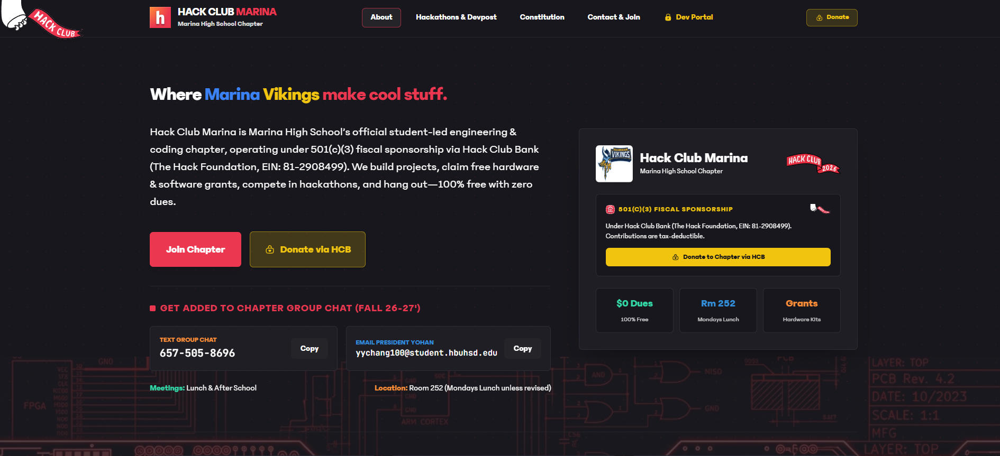

## Welcome to Marina HS Hackclub Chapter!!

We are very excited that you are here, thanks for checking us out! We are a group of teenagers from Marina HS who would like to bring the environment of coding and building meaningful projects to our community. We incorporate aspects of education, such as the creation of study apps, as well as the ethical use of AI. We teach club members about how to use AI properly as an assistant, not a full vibe-coding application.

-

## What we will be doing for Hackclub in the 2026-27 school year.

This school year, we will be doing the following Hackclub and other Hackathon events.

Nov. 14-15 - NASA Space Apps Challenge
All year - Hackclub Boba Drops web designing
All year - Hackclub CAD developing Cookie-Cutter
All year - Hackclub Sticker drops
Jan 1st - May 26th, 2027 - Coolest Projects 2027 Raspberry PI
May 1st - Oct. 26, 2027 - Congressional App Challenge

## What projects we will be building

We will be building a variety of projects. Due to our large size in club members, we will have many groups that will focus on different types of software/hardware projects. We will have approx 3+ teams of 6 people each for the NASA Space Apps Challenge program. We also will have around 15 people doing CAD related projects, as well as software developing. 

## We are verified by Hackclub. We are also part of the fiscal partnership for Hack Foundation!

As of September 25, 2026, Marina HS Hackclub Chapter was ratified into the Hack Foundation fiscal partnership program. Marina HS Hackclub Chapter also was ratified into the Marina HS club constitution and officialy registered for the 2026-2027 club roster.

## WE NEED YOUR SUPPORT. ANYTHING HELPS!

To make our hardware, software, 3D printing, and unique innovative ideas come to life, we need your support! You can donate to our program safely and securely through Hackclub Bank at: https://hcb.hackclub.com/donations/start/hackclub-marina-chapter

The	Hack	Foundation	is	a	501(c)(3)	public	charity
with	the	EIN	81-2908499
